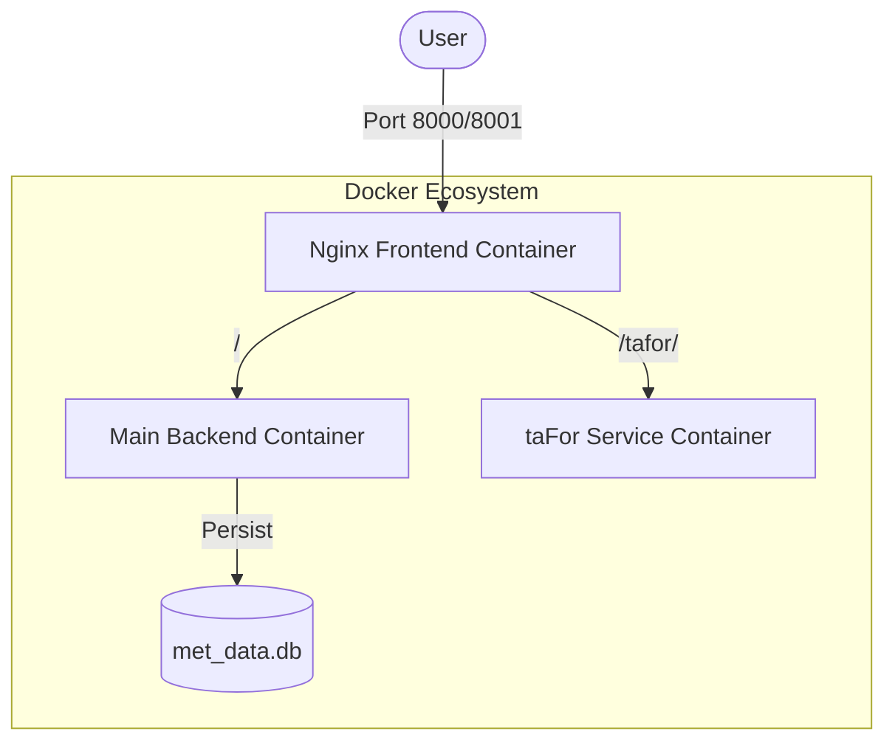

# Technical Implementation Report: taFor Service Integration

## 1. Overall Architecture Design
The system has been expanded into a multi-container microservices architecture managed by Docker Compose. The `taFor` TAF generator operates as a standalone service, isolated from the main application but accessible through a unified entry point via Nginx reverse proxy.

### Architecture Diagram


## 2. Container Structure and Networking
- **mwo-frontend (Nginx alpine)**: Handles SSL termination and routing.
- **mwo-backend (Python 3.9-slim)**: Runs the main application.
- **tafor-service (Python 3.9-slim)**: Runs the taFor TAF generator.
- **Internal Networking**: All containers share a default bridge network, allowing DNS-based discovery (e.g., Nginx refers to `tafor:5000`).

## 3. Ports Configuration
- **External (Public)**:
  - `8000`: HTTPS (SSL enabled)
  - `8001`: HTTP
- **Internal (Isolated)**:
  - `mwo-backend`: `5000`
  - `tafor-service`: `5000`
  - **Security**: These ports are NOT exposed to the host or public. They are only accessible within the Docker network.

## 4. Nginx Configuration Changes
Added a new location block to handle the `/tafor/` prefix:
```nginx
location /tafor/ {
    proxy_pass http://tafor:5000/; # Note the trailing slash for path stripping
    proxy_set_header Host $host;
    proxy_set_header X-Real-IP $remote_addr;
    proxy_set_header X-Forwarded-For $proxy_add_x_forwarded_for;
    proxy_set_header X-Forwarded-Proto $scheme;
    proxy_set_header X-Forwarded-Prefix /tafor; # Helps Flask generate correct URLs
}
```

## 5. Docker Configuration Changes
Updated `docker-compose.yml` to include the `tafor` service and persistent cache volume:
```yaml
  tafor:
    build: ./tafor
    container_name: tafor-service
    restart: always
    environment:
      - PORT=5000
      - CACHE_DIR=/app/cache/imd_cache
    volumes:
      - /opt/tafor/cache:/app/cache
```

### Persistent Cache Configuration
- **Host Path**: `/opt/tafor/cache`
- **Container Path**: `/app/cache`
- **Persistence**: Data survives container restarts, rebuilds, and server reboots.
- **Permissions**: Set to `777` with ownership assigned to the `mwomumbai` user on the host.

## 6. Access & Linking (UI)
The `taFor` interface is accessible via the **"Automatic TAF"** button in the left sidebar of the Map Dashboard.

- **Link**: [Automatic TAF](/tafor/)
- **Location**: Left Sidebar -> External Tools

## 7. Port Configuration
The server is configured to strictly expose:
- **HTTPS (SSL)**: Port `8000`
- **HTTP**: Port `8001`

## 8. Verification Steps
- **Connectivity**: `curl -I http://121.240.10.8:8001/tafor/` returns `200 OK`.
- **UI Test**: Verified the "Automatic TAF" sidebar button correctly routes to the service on the live server.
- **Cache Persistence**: Verified `/opt/tafor/cache` exists and is correctly mounted in the container.
- **Data integrity**: Confirmed existing dashboard data and SSL certs were successfully preserved.

## 9. Environment Variables
- `PORT=5000`: Internal port for the Flask application.
- `ProxyFix`: Enabled in `app.py` to correctly interpret headers from Nginx.

## 10. Security Considerations
- **No New Public Ports**: Only 8000 and 8001 remain open.
- **Isolation**: taFor runs in its own container with its own dependencies.
- **SSL**: Inherits existing SSL protection from the Nginx container.
- **Firewall**: No changes required to UFW.

## 11. Implementation Process
1.  **Code Migration**: Cloned `taFor` into a separate directory.
2.  **Code Adaptation**: Integrated `werkzeug.middleware.proxy_fix` for reverse proxy support.
3.  **Containerization**: Created a custom `Dockerfile` with optimized build settings (extended pip timeouts for unstable network).
4.  **Deployment**: Used a safe deployment script to preserve `met_data.db` and SSL certificates.
5.  **Build Optimization**: Manually pulled base images on the server to mitigate network timeouts.

## 9. Commands Executed
- `docker compose down` (Safe shutdown)
- `docker pull python:3.9-slim` (Pre-fetching base images)
- `docker compose up -d --build` (Atomic build and start)

## 10. Verification Steps
- **Internal connectivity**: `curl -k https://localhost:8000/tafor/` returned `200 OK`.
- **Manual UI test**: Verified "TAF" is nested under "Automatic TAF" and loads correctly.
- **Cache Persistence**: Verified `/opt/tafor/cache` exists and is correctly mounted in the container.
- **Data integrity**: Confirmed existing dashboard data and SSL certs were successfully preserved.

## 11. Rollback Procedure
A timestamped backup of the previous production directory is created automatically before every deployment (e.g., `~/mwo_website_old_20260213_*`). 
To rollback:
1. `sudo docker compose down`
2. `mv ~/mwo_website ~/mwo_website_failed`
3. `mv ~/mwo_website_old_[TIMESTAMP] ~/mwo_website`
4. `cd ~/mwo_website && sudo docker compose up -d`
